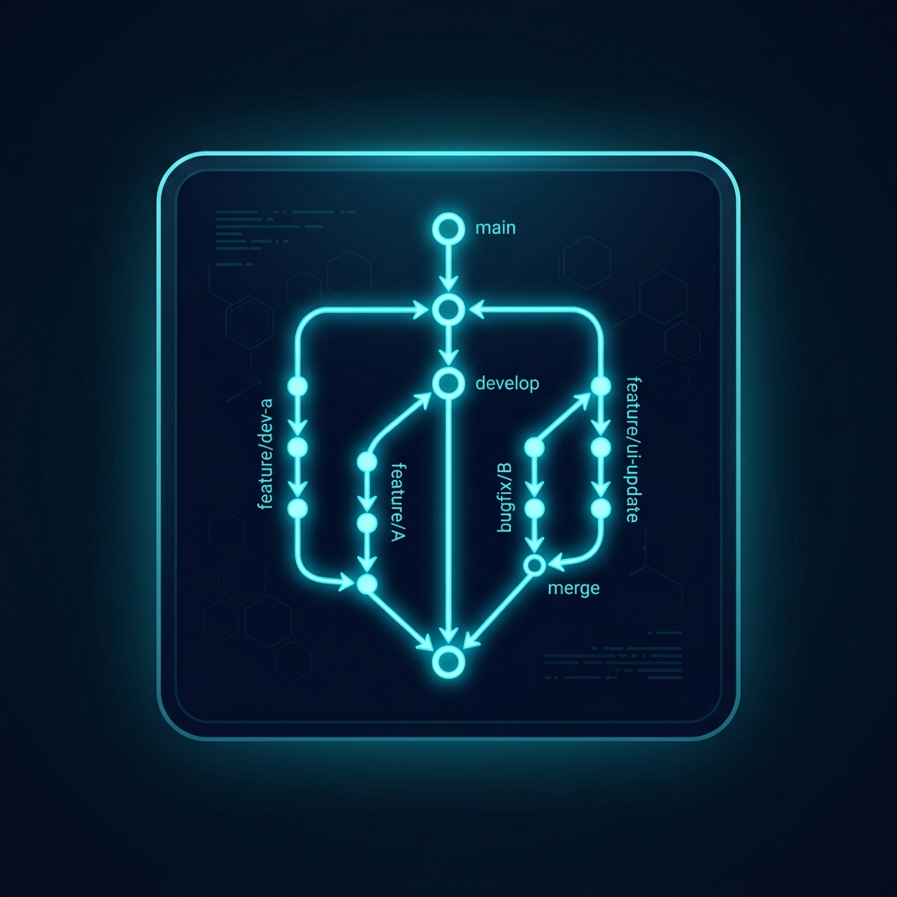
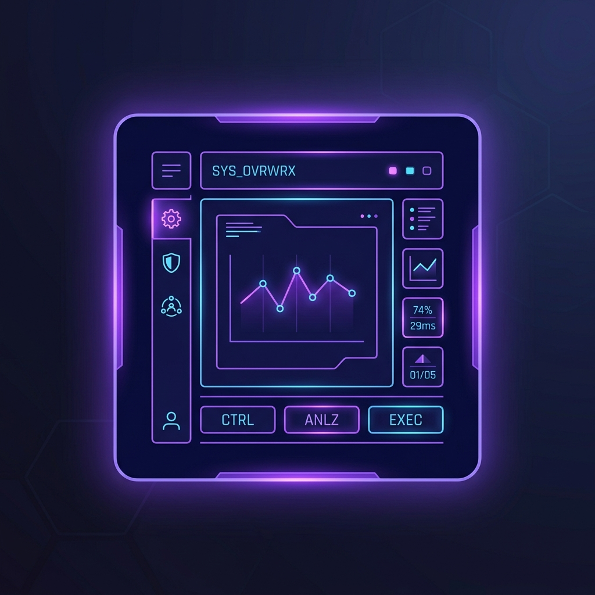

<p align="center">
  
</p>

<p align="center">
  <a href="https://www.linkedin.com/in/krish-kumar-95b452399"></a>
  <a href="https://github.com/anuragbraveboy-sudo"></a>
  
</p>

---

## 🙋‍♂️ About Me

Information Technology student at IIIT Vadodara with a strong passion for engineering modern, responsive, and visually stunning web interfaces. I focus on clean UI design, solid architecture, and interactive frontend applications.

### ⚡ What Drives Me
I love bringing ideas to life through code. Whether it is solving complex algorithmic problems or crafting fluid, animated web experiences, I believe code should be both functional and delightful to interact with.

---

## 🚀 Featured Projects

<table width="100%" border="0" cellpadding="10" cellspacing="0">
  <tr>
    <td width="50%" valign="top" style="border: 1px solid #1e293b; border-radius: 8px; background: #0b0f19;">
      <h4>🤖 AI Gesture Visualizer</h4>
      <p><i>Real-time Hand Gesture Recognition &amp; System Control</i></p>
      <p>An intelligent system powered by computer vision to track and recognize human hand gestures, translating them into interactive controls and visual displays.</p>
      <p><b>Impact:</b></p>
      <ul>
        <li>Real-time multi-hand tracking with minimal latency</li>
        <li>Dynamic visual path mapping for tracking gestures</li>
        <li>Integrated direct system input control maps</li>
      </ul>
      <p><b>Tech Stack:</b> Python, OpenCV, MediaPipe, NumPy</p>
    </td>
    <td width="50%" valign="top" style="border: 1px solid #1e293b; border-radius: 8px; background: #0b0f19;">
      <h4>📅 Eventra Platform</h4>
      <p><i>Ticketing &amp; Event Management Portal</i></p>
      <p>A comprehensive web platform that simplifies event creation, ticket booking, user check-ins, and analytics tracking in a seamless interface.</p>
      <p><b>Impact:</b></p>
      <ul>
        <li>Streamlined ticket generation and secure verification</li>
        <li>Real-time event booking and updates</li>
        <li>Frosted glass dashboard UI with interactive statistics</li>
      </ul>
      <p><b>Tech Stack:</b> React, JavaScript, HTML5, CSS3, Tailwind CSS</p>
    </td>
  </tr>
</table>

---

## 🛠️ Tech Stack

<h4 align="center">Frontend Development</h4>
<p align="center">
  
</p>

<h4 align="center">Backend Development</h4>
<p align="center">
  
</p>

<h4 align="center">Database &amp; DevOps</h4>
<p align="center">
  
</p>

---

## 📊 GitHub Analytics

<table width="100%" border="0" cellpadding="10" cellspacing="0">
  <tr>
    <td width="50%" align="center" valign="middle">
      
    </td>
    <td width="50%" align="center" valign="middle">
      
    </td>
  </tr>
  <tr>
    <td width="50%" align="center" valign="middle">
      
    </td>
    <td width="50%" align="center" valign="middle">
      
    </td>
  </tr>
</table>

---

## ⚡ Current Focus &amp; Interests

```javascript
const dev = {
  currentRole: "IT Student at IIIT Vadodara",
  experience: ["Frontend Engineering", "UI/UX Design", "Open Source Development"],
  learning: ["Advanced React Patterns", "System Architecture", "Computer Vision / AI Integration"],
  interests: ["Interactive Web Design", "Automation Systems", "Open Source Contribution"],
  techInterests: ["Creative Frontend UI", "Data Visualization", "AI/CV Integration Systems"]
};
```

---

## 🎨 Beyond Code

<table width="100%" border="0" cellpadding="10" cellspacing="0" align="center">
  <tr>
    <td width="25%" align="center" valign="top" style="border: 1px solid #1e293b; border-radius: 8px; background: #0b0f19;">
      
      <br/><br/><b>Open Source</b><br/><i>Exploring codebases</i>
    </td>
    <td width="25%" align="center" valign="top" style="border: 1px solid #1e293b; border-radius: 8px; background: #0b0f19;">
      
      <br/><br/><b>UI/UX Design</b><br/><i>Crafting interfaces</i>
    </td>
    <td width="25%" align="center" valign="top" style="border: 1px solid #1e293b; border-radius: 8px; background: #0b0f19;">
      
      <br/><br/><b>Gaming</b><br/><i>Strategy &amp; Tactics</i>
    </td>
    <td width="25%" align="center" valign="top" style="border: 1px solid #1e293b; border-radius: 8px; background: #0b0f19;">
      
      <br/><br/><b>Side Projects</b><br/><i>Building ideas</i>
    </td>
  </tr>
</table>

---

## 🐍 Contribution Snake

<div align="center">
  <picture>
    <source media="(prefers-color-scheme: dark)" srcset="https://raw.githubusercontent.com/anuragbraveboy-sudo/anuragbraveboy-sudo/output/github-contribution-grid-snake-dark.svg">
    <source media="(prefers-color-scheme: light)" srcset="https://raw.githubusercontent.com/anuragbraveboy-sudo/anuragbraveboy-sudo/output/github-contribution-grid-snake.svg">
    
  </picture>
</div>

---

## 🤝 Let's Connect

<p align="center">I'm always open to discussing new projects, creative ideas, or opportunities to be part of your vision.</p>
<p align="center">
  <a href="https://www.linkedin.com/in/krish-kumar-95b452399"></a>
  <a href="https://github.com/anuragbraveboy-sudo"></a>
</p>

<p align="center">
  
</p>
