  

  
  
  

---

## 🙋‍♂️ About Me

Exploring the vast universe of technology through code, open source, and continuous learning. Passionate about building, contributing, and growing every day.

### ⚡ What Drives Me
Curiosity to explore the unknown, discipline to keep improving, and the ambition to turn ideas into reality. ✨

---

## 🛠️ Tech Stack

<h4 align="center">Frontend Development</h4>

  

<h4 align="center">Backend Development</h4>

  

<h4 align="center">DevOps &amp; Tools</h4>

  

---

## 📊 GitHub Analytics

<table width="100%" border="0" cellpadding="10" cellspacing="0">
  <tr>
    <td width="50%" align="center" valign="middle">
      
    </td>
    <td width="50%" align="center" valign="middle">
      
    </td>
  </tr>
  <tr>
    <td width="50%" align="center" valign="middle">
      
    </td>
    <td width="50%" align="center" valign="middle">
      
    </td>
  </tr>
</table>

---

## ⚡ Current Focus &amp; Interests

  

---

## 🤝 Let's Connect

I'm always open to discussing new projects, creative ideas, or opportunities to be part of your vision.

  
  

  

