  

  

<h1 align="center">
  &lt;ANURAG.DEV /&gt;
</h1>

  [system_status: ACTIVE // telemetry_node: CONNECTED]

  

## 🖥️ System Details

<table align="center" border="0" cellpadding="10" cellspacing="0">
  <tr>
    <td valign="top" width="50%">
      <h3>📂 Core Directories</h3>
      <ul>
        <li>🎓 Information Technology Student</li>
        <li>⚛️ Engineering with React, JavaScript & TypeScript</li>
        <li>🌱 Contributing to Open Source repositories</li>
        <li>📍 Local IP: India (Asia/Kolkata)</li>
      </ul>
    </td>
    <td valign="top" width="50%">
      <h3>🛠️ Core Engine Stack</h3>
      

        <code>Python</code> &bull; <code>Java</code> &bull; <code>JavaScript</code> &bull; <code>TypeScript</code> 
        <code>React</code> &bull; <code>HTML5</code> &bull; <code>CSS3</code> &bull; <code>Tailwind</code> &bull; <code>Git</code>
      

    </td>
  </tr>
</table>

  

## 📊 Telemetry Data

  

### 🏆 Achievements Logged

  

### 🐍 Code Execution Pipeline

<picture>
  <source media="(prefers-color-scheme: dark)" srcset="https://raw.githubusercontent.com/anuragbraveboy-sudo/anuragbraveboy-sudo/output/github-contribution-grid-snake-dark.svg">
  <source media="(prefers-color-scheme: light)" srcset="https://raw.githubusercontent.com/anuragbraveboy-sudo/anuragbraveboy-sudo/output/github-contribution-grid-snake.svg">
  
</picture>

  

## 🤝 Handshake Nodes

